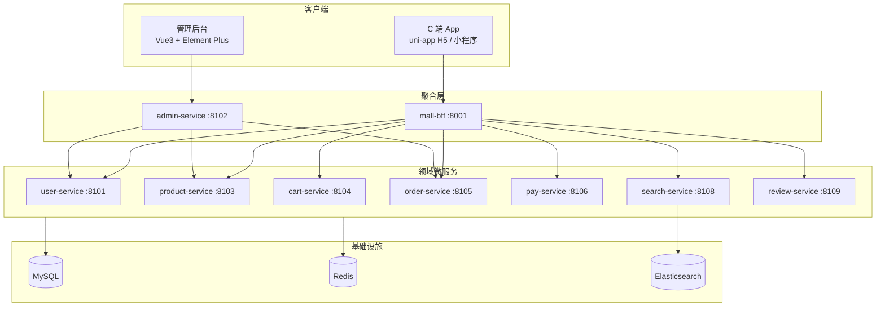

# ComonOn Mall

ComonOn Mall 是一个面向 B2C 场景的全栈电商平台，采用微服务架构，覆盖 C 端购物、管理后台与完整交易链路。项目支持实物、虚拟卡密、服务核销三类商品，已打通「浏览 → 加购 → 下单 → 支付 → 履约 → 评价」的端到端流程。

## 功能特性

### C 端（App / H5 / 微信小程序）

- 商品浏览：首页、分类、搜索、商品详情
- 购物车：加购、改数量、勾选、结算预览
- 交易流程：确认订单、Mock 支付、订单列表与详情
- 履约展示：物流信息、虚拟卡密、服务核销码
- 用户中心：短信/微信登录、资料编辑、收货地址、设备管理、订单评价

### 管理后台

- 安全登录：两步验证（账号密码 + 短信验证码）、强制改密
- 权限体系：RBAC 角色权限、路由守卫、`v-perm` 指令
- 运营管理：Dashboard 统计、商品/类目管理、订单管理、会员管理
- 履约运营：虚拟卡密导入、服务核销、评价审核
- 审计日志：关键操作记录与多条件查询

## 技术栈

| 层级 | 技术 |
|------|------|
| 后端 | Java 21、Spring Boot 3.3、MyBatis-Plus、JWT、Maven 多模块 |
| C 端 | uni-app、Vue 3、Vite、Pinia、TypeScript |
| 管理端 | Vue 3、Vite、Pinia、Element Plus、TypeScript |
| 数据 | MySQL 8、Redis 7、Elasticsearch 8（搜索） |
| 部署 | Docker Compose（中间件）+ 宿主机运行 Java 服务 |

## 架构概览



**设计原则**：先写设计文档 → 领域服务 → BFF 聚合 → 管理端 → C 端 App；管理端与 C 端共用同一套领域数据。

## 项目结构

```
mall/
├── backend/              # 后端多模块工程
│   ├── common/           # 通用库（JWT、统一响应、异常处理等）
│   ├── user-service/     # C 端用户与地址
│   ├── admin-service/    # 管理后台 API
│   ├── product-service/  # 商品与库存
│   ├── cart-service/     # 购物车
│   ├── order-service/    # 订单与履约
│   ├── pay-service/      # 支付
│   ├── search-service/   # 商品搜索
│   ├── review-service/   # 订单评价
│   ├── mall-bff/         # C 端 BFF 聚合层
│   └── sql/              # 数据库 DDL
├── frontend/
│   ├── app/              # C 端 uni-app
│   └── admin-web/        # 管理后台
├── deploy/               # Docker Compose、启动脚本、SQL patch
└── docs/                 # 路线图与设计索引
```

## 环境要求

- JDK 21
- Maven 3.6+
- Node.js 18+ 与 pnpm
- Docker 与 Docker Compose（用于 MySQL / Redis / Elasticsearch）

## 快速开始

### 1. 克隆仓库

```bash
git clone https://github.com/jone-code/mall.git
cd mall
```

### 2. 启动中间件

```bash
cd deploy
./start.sh up
```

| 中间件 | 地址 | 说明 |
|--------|------|------|
| MySQL | `localhost:13306` | 用户 `root` / 密码 `root`，数据库 `mall` |
| Redis | `localhost:16379` | C 端 db=0，管理端 db=1 |
| Elasticsearch | `localhost:9200` | 商品搜索（可选） |

默认管理员账号：`admin` / `Admin@12345`

### 3. 初始化业务表（首次部署）

Docker 首启会执行 `mysql-init.sql`（用户与权限相关表）。商品、订单、支付等表需按需执行 patch：

```bash
cd deploy
MYSQL="mysql --default-character-set=utf8mb4 -h127.0.0.1 -P13306 -uroot -proot mall"

$MYSQL < patch-product-tables.sql
$MYSQL < patch-user-address.sql
$MYSQL < patch-order-pay-tables.sql
$MYSQL < patch-payment-unique.sql
$MYSQL < patch-admin-permissions.sql
$MYSQL < patch-orders-stats-index.sql

# 可选：导入演示商品数据
$MYSQL < seed-products.sql
```

> 执行 SQL 时请始终加 `--default-character-set=utf8mb4`，避免中文乱码。

### 4. 启动后端服务

```bash
cd deploy
export MALL_JWT_SECRET=dev_secret_please_change_to_a_long_random_string_32bytes
export MALL_ADMIN_JWT_SECRET=dev_admin_secret_please_change_32bytes_long_random
./run-services.sh up
```

查看启动状态与日志：

```bash
./run-services.sh status
tail -f logs/mall-bff.log
```

### 5. 启动前端

**管理后台**（默认 http://localhost:5173）：

```bash
cd frontend/admin-web
pnpm install
pnpm dev
```

**C 端 App H5**（默认 http://localhost:5174，API 代理到 BFF :8001）：

```bash
cd frontend/app
pnpm install
pnpm dev:h5
```

**微信小程序**：

```bash
cd frontend/app
pnpm dev:mp-weixin
```

## 服务端口

| 服务 | 端口 | 说明 |
|------|------|------|
| mall-bff | 8001 | C 端统一入口，JWT 鉴权与 API 聚合 |
| user-service | 8101 | 用户登录、资料、收货地址 |
| admin-service | 8102 | 管理后台 API |
| product-service | 8103 | 类目、SPU/SKU、库存 |
| cart-service | 8104 | Redis 购物车 |
| order-service | 8105 | 订单、虚拟卡密、服务核销 |
| pay-service | 8106 | 支付单与 Mock 回调 |
| search-service | 8108 | 商品搜索 |
| review-service | 8109 | 订单评价 |
| admin-web | 5173 | 管理后台前端 |
| app H5 | 5174 | C 端 H5 开发服务器 |

## 环境变量

### 后端

| 变量 | 说明 |
|------|------|
| `MALL_JWT_SECRET` | C 端 JWT 签名密钥（≥ 32 字节） |
| `MALL_ADMIN_JWT_SECRET` | 管理端 JWT 签名密钥 |
| `MYSQL_HOST` | MySQL 地址，默认 `127.0.0.1` |
| `MYSQL_PORT` | MySQL 端口，默认 `13306` |
| `REDIS_HOST` | Redis 地址，默认 `127.0.0.1` |
| `REDIS_PORT` | Redis 端口，默认 `16379` |

### C 端 App

| 变量 | 说明 |
|------|------|
| `VITE_API_BASE` | API 根路径，默认 `/api` |
| `VITE_FILE_BASE` | 静态文件根路径 |
| `VITE_WECHAT_APPID` | H5 微信 OAuth AppID |

### 管理后台

| 变量 | 说明 |
|------|------|
| `VITE_API_BASE` | 后端地址，默认 `http://localhost:8102` |
| `VITE_ENV` | 环境标识（`test` / `prod`） |

## 本地联调说明

- **短信 / 微信登录**：开发环境为 Stub 模式，验证码打印到 Spring Boot 控制台或 `deploy/logs/*.log`
- **Mock 支付**：C 端支付页可直接模拟支付成功，用于联调订单状态流转
- **JWT 密钥**：仅供本地开发，请勿用于生产环境

一键脚本（需安装 `jq`）：

```bash
# C 端：发短信 → 登录 → 获取资料 → 刷新 Token → 登出
./scripts/sim-client.sh

# 管理端：图形验证码 → 两步登录 → 获取资料 → 登出
./scripts/sim-admin.sh
```

## 文档

| 文档 | 说明 |
|------|------|
| [docs/roadmap.md](docs/roadmap.md) | 开发路线图与阶段规划 |
| [docs/design-index.md](docs/design-index.md) | 设计文档索引 |
| [docs/ops-polish-plan.md](docs/ops-polish-plan.md) | 运营体验打磨计划 |
| [backend/README.md](backend/README.md) | 后端模块说明 |
| [deploy/README.md](deploy/README.md) | 部署与联调指南 |
| [frontend/app/README.md](frontend/app/README.md) | C 端 App 说明 |
| [frontend/admin-web/README.md](frontend/admin-web/README.md) | 管理后台说明 |

## 开发阶段

| 阶段 | 内容 | 状态 |
|------|------|------|
| Phase 0 | 用户认证与会话管理 | ✅ 已完成 |
| Phase 1 | 商品目录 | ✅ 已完成 |
| Phase 2 | 地址与购物车 | ✅ 已完成 |
| Phase 3 | 订单与库存 | ✅ 已完成 |
| Phase 4 | 支付（Mock） | ✅ 已完成 |
| Phase 5 | 履约（实物/虚拟/服务） | ✅ 已完成 |
| Phase 6–8 | 运营体验、搜索评价、运维增强 | 🔄 持续迭代 |

## 刻意不做（YAGNI）

以下能力暂不纳入排期，避免过早膨胀：

- 优惠券 / 秒杀 / 拼团
- 多商家入驻
- 物流自营
- 邮箱登录、Apple 登录
- 服务网格 / Nacos

## License

本项目暂未指定开源协议，使用前请联系仓库维护者。
