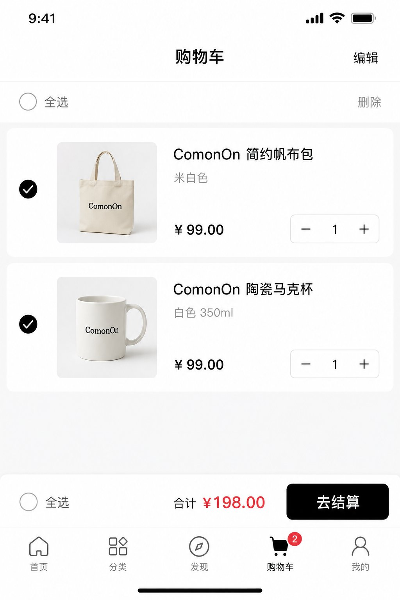
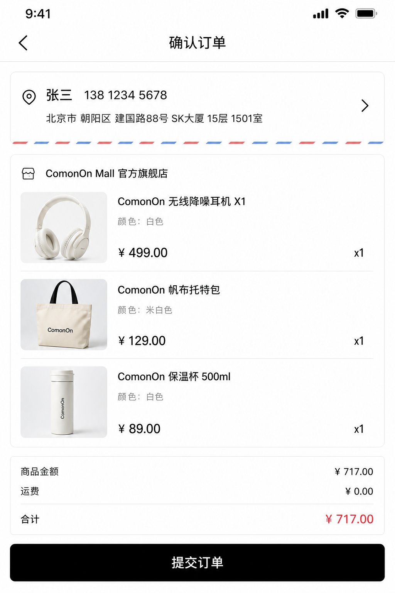
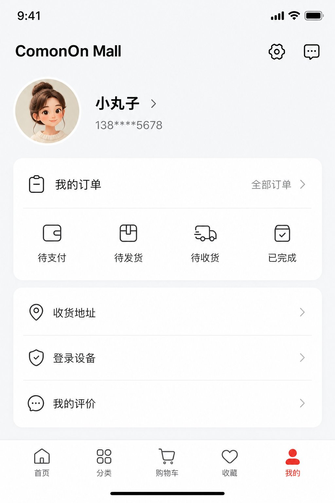
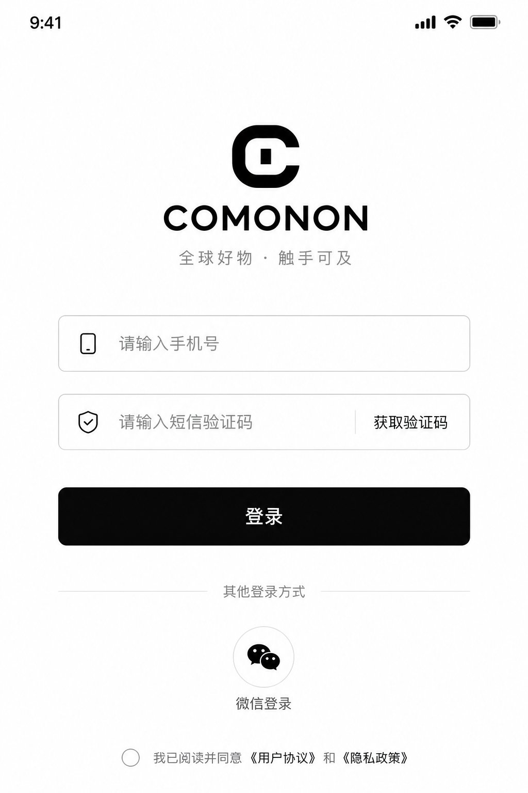
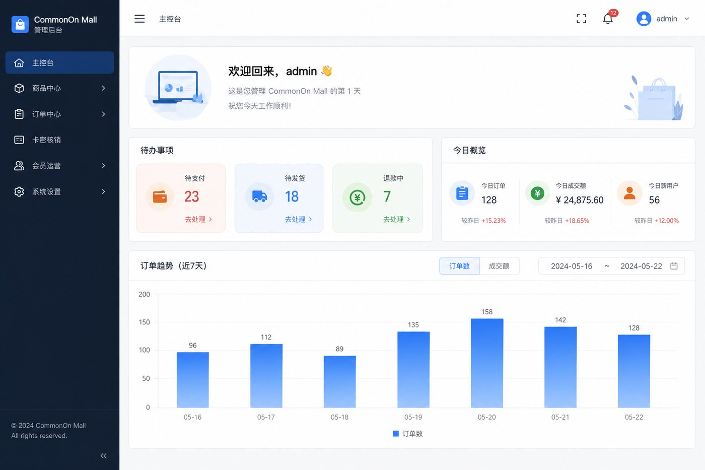
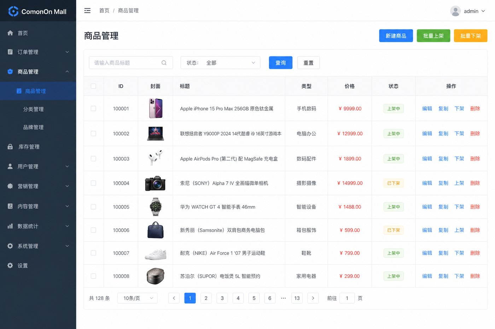
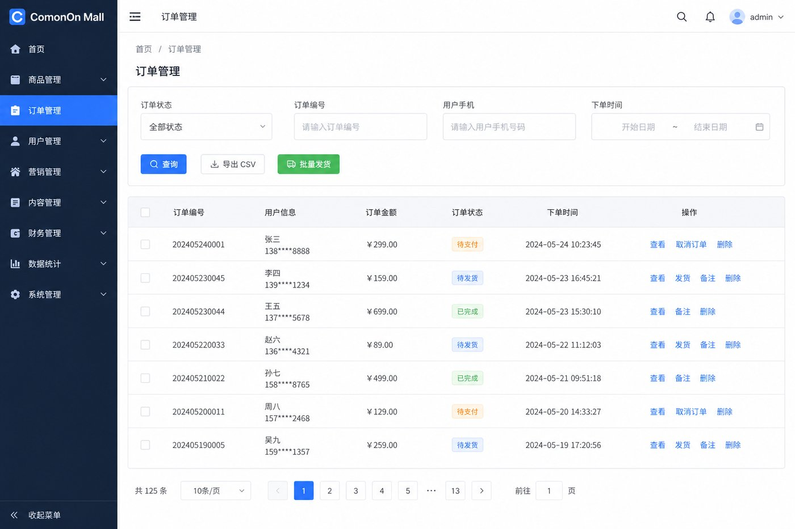
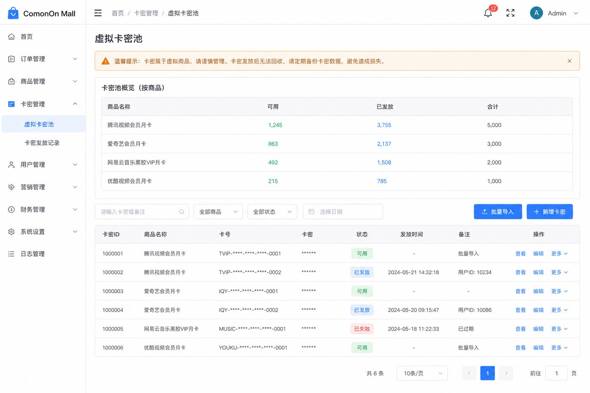
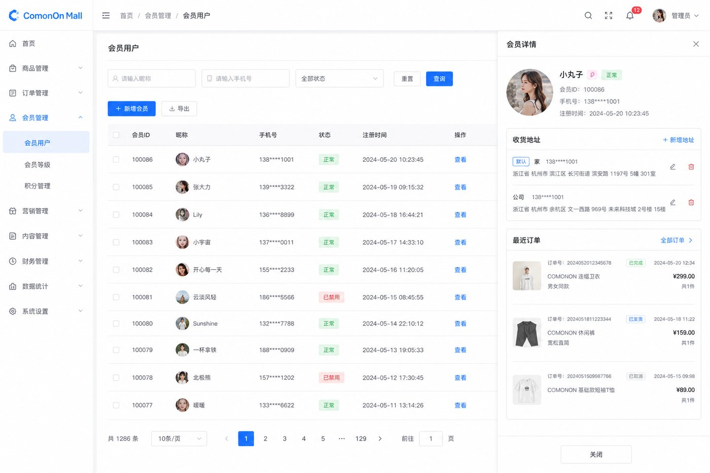
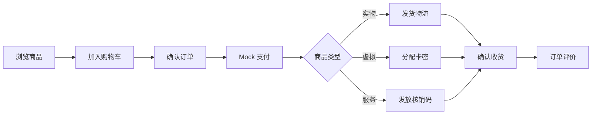

# ComonOn Mall 项目功能介绍

ComonOn Mall 是一套面向 B2C 场景的全栈电商平台，支持 **实物、虚拟卡密、服务核销** 三类商品，覆盖从浏览、加购、下单、支付到履约、评价的完整链路。客户端包含 **C 端 App（H5 / 微信小程序）** 与 **管理后台 Web** 两套界面。

> 本文配图基于产品 UI 设计生成的功能示意截图，用于快速了解各模块能力。本地运行后可获得真实界面效果。

---

## 一、产品定位

| 维度 | 说明 |
|------|------|
| 目标用户 | C 端消费者 + 平台运营人员 |
| 商品类型 | 实物（物流发货）、虚拟（卡密发放）、服务（核销码） |
| 部署形态 | 微服务后端 + BFF 聚合 + 双端前端 |
| 当前阶段 | 核心链路已打通，支付/短信/物流等第三方能力为 Mock，可逐步生产化 |

---

## 二、C 端 App 功能（`frontend/app`）

技术栈：**uni-app + Vue 3 + Pinia + TypeScript**，支持 H5 与微信小程序。

### 2.1 首页与商品浏览

- 首页精选 Banner、类目快捷入口、新品推荐瀑布流
- 分类 Tab 按类目筛选商品
- 关键词搜索（对接 Elasticsearch）
- 商品详情：轮播图、规格 SKU 选择、评价展示、加购/立即购买


| 页面 | 路径 | 核心能力 |
|------|------|----------|
| 首页 | `pages/index/index` | 类目导航、推荐商品、下拉刷新 |
| 分类 | `pages/category/index` | 类目树浏览、商品列表 |
| 搜索 | `pages/search/index` | 关键词搜索、分页加载 |
| 商品详情 | `pages/product/detail` | SKU 选择、库存校验、加购 |

### 2.2 购物车与下单

- Redis 购物车：加购、改数量、勾选、失效项清理
- 结算预览：校验库存与价格
- 确认订单：选择收货地址、展示费用明细
- Mock 支付：本地联调一键模拟支付成功





| 页面 | 路径 | 核心能力 |
|------|------|----------|
| 购物车 | `pages/cart/index` | 勾选结算、数量步进、合计金额 |
| 确认订单 | `pages/order/confirm` | 地址选择、商品清单、运费 |
| 收银台 | `pages/order/pay` | Mock 支付、结果轮询 |
| 支付结果 | `pages/order/pay-result` | 成功/失败态展示 |

### 2.3 订单与履约

- 订单列表：按状态筛选（待支付 / 待发货 / 待收货 / 已完成等）
- 订单详情：状态流转、物流信息（Mock）、虚拟卡密、服务核销码
- 订单评价：星级 + 文字（低分评价可附带 Mock 晒图）

| 页面 | 路径 | 核心能力 |
|------|------|----------|
| 我的订单 | `pages/order/list` | 列表、取消、去支付 |
| 订单详情 | `pages/order/detail` | 物流/卡密/核销码展示 |
| 订单评价 | `pages/order/review` | 提交评价 |
| 我的评价 | `pages/order/my-reviews` | 历史评价列表 |

### 2.4 用户中心

- 短信 / 微信登录（开发环境 Stub）
- 资料编辑、头像上传
- 收货地址 CRUD、默认地址
- 登录设备管理（查看 / 踢出会话）
- 双 Token 无感续期





| 页面 | 路径 | 核心能力 |
|------|------|----------|
| 我的 | `pages/mine/index` | 订单入口、地址、设备管理 |
| 登录 | `pages/login/index` | 短信 / 微信登录 |
| 收货地址 | `pages/address/list` | 增删改、设默认 |
| 登录设备 | `pages/mine/sessions` | 多设备会话管理 |

### 2.5 C 端 Tab 结构

```
首页 ─ 分类 ─ 购物车 ─ 我的
```

---

## 三、管理后台功能（`frontend/admin-web`）

技术栈：**Vue 3 + Vite + Element Plus + Pinia + TypeScript**。

### 3.1 登录与安全

- 两步登录：账号密码 + 图形验证码 → 短信验证码
- 7 天免登录（localStorage 持久化 + 静默 Refresh）
- 强制改密、RBAC 权限、路由守卫、`v-perm` 按钮级权限
- 登录设备查看与踢下线


### 3.2 主控台

- 今日订单 / GMV / 新用户统计
- 运营待办：待支付、待发货、退款中、卡密/核销码池预警
- 差评预警（1–2 星评价）
- 订单趋势图（近 7 / 30 天）
- 统计卡片可点击穿透到预筛选列表



### 3.3 商品中心

| 模块 | 能力 |
|------|------|
| 类目管理 | 二级类目树、启用/禁用 |
| 商品管理 | SPU/SKU CRUD、上下架、批量操作、图片上传 |
| 商品复制 | 一键复制为草稿（含 SKU + 库存） |
| 库存记录 | SKU 维度库存变更流水查询 |



### 3.4 订单中心

| 模块 | 能力 |
|------|------|
| 订单管理 | 多条件筛选、详情、发货、关单、退款审核 |
| 批量发货 | 勾选实物订单批量填物流单号 |
| 数据导出 | 按筛选条件导出 CSV |
| 用户评价 | 多维筛选、隐藏/恢复、晒图预览 |



### 3.5 卡密与核销

| 模块 | 能力 |
|------|------|
| 虚拟卡密池 | 按商品概览、批量导入、导入报告、脱敏展示 |
| 核销码池 | 服务商品码池管理（对齐卡密池体验） |
| 服务核销 | 扫码枪/输入核销码完成到店核销 |



### 3.6 会员与系统

| 模块 | 能力 |
|------|------|
| 会员用户 | 列表分页、详情（地址 + 近期订单）、状态变更留痕 |
| 管理账号 | 账号 CRUD、角色分配、密码重置 |
| 权限管理 | 角色/权限 CRUD、菜单按权限渲染 |
| 审计日志 | 操作记录查询、筛选、CSV 导出 |



### 3.7 管理端菜单结构

```
主控台
├── 商品中心
│   ├── 类目管理
│   └── 商品管理
├── 订单中心
│   ├── 订单管理
│   └── 用户评价
├── 卡密核销
│   ├── 虚拟卡
│   ├── 核销码池
│   └── 服务核销
├── 会员运营
│   └── 会员用户
└── 系统设置
    ├── 管理账号
    ├── 权限管理
    └── 审计日志
```

---

## 四、后端服务能力

| 服务 | 端口 | 职责 |
|------|------|------|
| mall-bff | 8001 | C 端 API 聚合、JWT 鉴权 |
| user-service | 8101 | 用户登录、地址、会话 |
| admin-service | 8102 | 管理端 API、权限代理 |
| product-service | 8103 | 商品、类目、库存 |
| cart-service | 8104 | Redis 购物车 |
| order-service | 8105 | 订单、卡密、核销码 |
| pay-service | 8106 | 支付单、Mock 回调 |
| search-service | 8108 | Elasticsearch 搜索 |
| review-service | 8109 | 订单评价 |

---

## 五、三类商品履约对比

| 类型 | C 端体验 | 管理端运营 |
|------|----------|------------|
| 实物 PHYSICAL | 选地址 → 下单 → 支付 → 查看物流 | 发货填单号、批量发货 |
| 虚拟 VIRTUAL | 支付后查看卡密（脱敏 + 复制） | 卡密池导入、库存预警 |
| 服务 SERVICE | 支付后展示核销码 / 二维码 | 核销码池管理、到店核销 |

---

## 六、端到端业务流程



---

## 七、本地体验

```bash
# 1. 启动中间件
cd deploy && ./start.sh up

# 2. 启动后端
./run-services.sh up

# 3. C 端 H5
cd frontend/app && pnpm dev:h5    # http://localhost:5174

# 4. 管理后台
cd frontend/admin-web && pnpm dev  # http://localhost:5173
```

默认管理员：`admin` / `Admin@12345`

---

## 相关文档

- [README.md](../README.md) — 项目总览与快速开始
- [roadmap.md](./roadmap.md) — 开发路线图
- [ops-polish-plan.md](./ops-polish-plan.md) — 运营体验打磨计划
