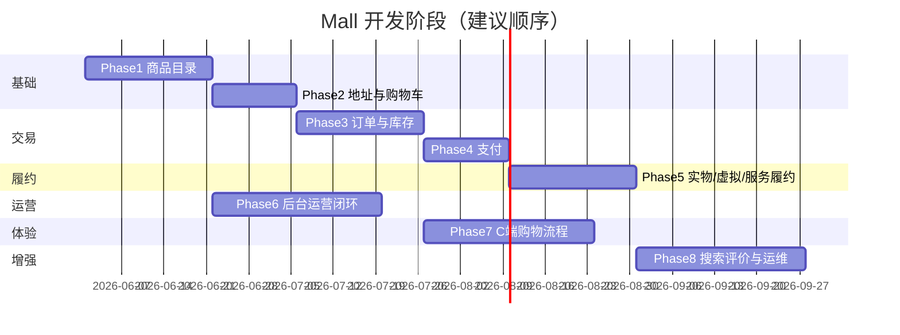

# ComonOn Mall 电商开发计划

> 基于 [电商平台总体设计](../../.comate/specs/ecommerce-platform/doc.md) 与当前仓库实现情况整理。  
> 用户模块视为 **Phase 0 已完成**，后续按依赖顺序推进。

---

## 一、当前基线（Phase 0 ✅）

| 模块 | 已完成 | 待补 |
|------|--------|------|
| **C 端用户** | 短信/微信登录、双 Token、Redis Session、完善资料、我的页 | 收货地址 CRUD、资料编辑页、管理端 refresh 持久化 |
| **mall-bff** | 用户 API 代理、JWT 鉴权、白名单 | 商品/购物车/订单聚合接口 |
| **admin-service** | 两步登录、管理账号、会员用户、权限管理、审计 API | 商品/订单/卡密等业务 API |
| **admin-web** | 登录、管理账号、会员用户、权限管理 | 商品/订单/卡密/审计页面 |
| **基础设施** | MySQL + Redis、deploy 脚本 | RabbitMQ、MinIO、Nginx |
| **商品** | product-service、后台类目/商品、C 端浏览 | Redis 商品缓存 |
| **地址/购物车** | — | Phase 2 设计已定稿，待开发 |

**贯穿全程的原则**

1. 先写设计 → 再后端领域服务 → BFF 聚合 → 管理端 → C 端 App
2. 每个 Phase 结束要有**可演示的端到端链路**
3. 管理端与 C 端**共用同一套领域数据**，admin 走 `admin-service` 直查/调领域服务

---

## 二、总体路线图



---

## Phase 1：商品目录（3 周）

**目标**：能上架商品，C 端能浏览类目和商品详情。

### 1.1 设计文档（你先写）

| 文档 | 状态 | 路径 |
|------|------|------|
| `product-design.md` | ✅ 已定稿 | [.comate/specs/ecommerce-platform/product-design.md](../../.comate/specs/ecommerce-platform/product-design.md) |
| `inventory-design.md` | ✅ 已定稿 | [.comate/specs/ecommerce-platform/inventory-design.md](../../.comate/specs/ecommerce-platform/inventory-design.md) |
| `product-ui-design.md` | ✅ 已定稿（含设计图 Prompt） | [.comate/specs/ecommerce-platform/product-ui-design.md](../../.comate/specs/ecommerce-platform/product-ui-design.md) |
| `product-ui.pen` | 待建 | 可用本文 §7 Prompt 出图或 Pencil 搭建 |

**设计评审通过后再开发** — 对照三份文档末尾「闭环检查」勾选。

### 1.2 后端 `product-service`（新服务，建议端口 8103）

| 任务 | 说明 |
|------|------|
| 建库表 | `category`、`spu`、`sku`、`sku_stock` |
| 类目 API | 树形查询、后台 CRUD |
| SPU/SKU API | 创建/编辑/上下架、规格属性 JSON |
| 库存 API | 查询库存、**预留** lock/release（Phase 3 对接） |
| 商品查询 | 分页列表、详情（含 SKU 列表） |

### 1.3 BFF `mall-bff`

- `GET /api/home` — 首页聚合（类目 + 推荐 SPU，可先写死推荐位）
- `GET /api/categories` — 类目树
- `GET /api/products` — 列表（类目/关键词筛选）
- `GET /api/products/{spuId}` — 详情

### 1.4 管理端

| 页面 | 权限码（建议） |
|------|----------------|
| 商品管理（替换占位页） | `product:read` / `product:write` |
| 类目管理（可嵌在商品里） | `product:write` |
| SKU/库存维护 | `product:write` |

### 1.5 C 端 App

| 页面 | 说明 |
|------|------|
| 首页 Tab | 类目入口 + 商品卡片列表 |
| 商品列表 | 按类目筛选 |
| 商品详情 | 轮播图、价格、规格 SKU 选择、「加入购物车」按钮（先 disabled，Phase 2 启用） |

### 1.6 验收标准

- [ ] 后台创建实物/虚拟/服务三类 SPU 各 1 个
- [ ] App 首页 → 列表 → 详情可浏览
- [ ] 下架商品 C 端不可见

---

## Phase 2：地址与购物车（2 周）

**目标**：登录用户可维护地址，可加购、改数量、勾选结算项。

### 2.1 设计文档

| 文档 | 状态 | 路径 |
|------|------|------|
| `address-design.md` | ✅ 已定稿 | [.comate/specs/ecommerce-platform/address-design.md](../../.comate/specs/ecommerce-platform/address-design.md) |
| `cart-design.md` | ✅ 已定稿 | [.comate/specs/ecommerce-platform/cart-design.md](../../.comate/specs/ecommerce-platform/cart-design.md) |
| `cart-address-ui-design.md` | ✅ 已定稿 | [.comate/specs/ecommerce-platform/cart-address-ui-design.md](../../.comate/specs/ecommerce-platform/cart-address-ui-design.md) |

**设计评审通过后再开发** — 对照三份文档末尾「闭环检查」勾选。

### 2.2 后端

**user-service 扩展**

- `address` 表 + `/me/addresses` CRUD、设默认地址

**cart-service 新建（建议 8104）**

- Redis 购物车：加购、改数量、删除、勾选、清空失效项
- 结算预览：返回勾选 SKU 快照（名称、价格、库存校验）

### 2.3 BFF

- 地址：`/api/me/addresses` 代理
- 购物车：`/api/cart` CRUD + `GET /api/cart/checkout-preview`

### 2.4 管理端

- 本阶段无新页面（会员详情可展示地址，可选）

### 2.5 C 端 App

| 页面 | 说明 |
|------|------|
| 购物车 Tab | 列表、勾选、数量步进器、合计 |
| 地址列表/编辑 | 我的 → 收货地址 |
| 商品详情 | 「加入购物车」可用 |

### 2.6 验收标准

- [ ] 加购后购物车数量角标正确
- [ ] 改地址、设默认地址生效
- [ ] 库存不足时加购失败有提示

---

## Phase 3：订单与库存（3 周）

**目标**：从购物车创建订单，30 分钟未支付自动关单释库存。

### 3.1 设计文档

| 文档 | 内容 |
|------|------|
| `order-design.md` | 订单状态机、订单号规则、超时关单 |
| `order-state.pen` | 待支付→已支付→待发货→已发货→完成 / 取消 |

**状态机（首期）**

```
待支付 → 已支付 → 待发货 → 已发货 → 已完成
   ↓         ↓
 已取消    退款中（可后置）
```

### 3.2 基础设施

- `deploy/docker-compose.yml` 增加 **RabbitMQ**
- 延迟队列 / TTL + 死信实现 30min 关单

### 3.3 后端 `order-service`（8105）

| 任务 | 说明 |
|------|------|
| 表 | `order`、`order_item`、`order_log` |
| 创建订单 | 读购物车勾选 → 调 product 锁库存 → 写单 → 发延迟消息 |
| 取消/超时 | 释库存、改状态 |
| 订单查询 | 列表、详情（用户维度） |

**product-service 补齐**

- `POST /internal/stock/lock`、`POST /internal/stock/release`（内部签名）

### 3.4 BFF

- `POST /api/orders` — 创建订单（需地址 ID）
- `GET /api/orders`、`GET /api/orders/{id}`
- `POST /api/orders/{id}/cancel` — 用户取消待支付单

### 3.5 管理端

| 页面 | 说明 |
|------|------|
| 订单管理（替换占位） | 列表、筛选、详情、手动关单（运营） |

### 3.6 C 端 App

| 页面 | 说明 |
|------|------|
| 确认订单 | 地址、商品清单、运费（实物）、合计 |
| 订单列表/详情 | 状态、取消按钮 |
| 我的 | 入口「我的订单」 |

### 3.7 验收标准

- [ ] 下单锁库存，超时自动取消并释放
- [ ] 后台可查看订单列表
- [ ] 同一 SKU 并发下单不超卖（压测或单测）

---

## Phase 4：支付（2 周）

**目标**：微信/支付宝沙箱支付，回调驱动订单「已支付」。

### 4.1 设计文档

- `pay-design.md`：支付单、回调幂等、与订单号关联

### 4.2 后端 `pay-service`（8106）

| 任务 | 说明 |
|------|------|
| 表 | `payment` |
| 创建支付 | 返回客户端调起参数 |
| 回调 | 验签 → 幂等更新 → 通知 order-service |
| 查询 | 支付状态 |

**首期建议**：H5 用微信 JSAPI 或支付宝 WAP；App 用对应 SDK；本地用 **Mock 支付** 按钮联调。

### 4.3 BFF / App

- `POST /api/orders/{id}/pay` — 发起支付
- 支付结果页 / 轮询订单状态

### 4.4 管理端

- 订单详情展示支付流水（只读）

### 4.5 验收标准

- [ ] Mock 支付后订单变「已支付」
- [ ] 重复回调不重复改状态

---

## Phase 5：履约（实物 / 虚拟 / 服务）（3 周）

**目标**：三类商品支付后走不同履约策略。

### 5.1 设计文档

- `fulfillment-design.md`：策略模式、虚拟卡密池、服务核销码

### 5.2 后端 `virtual-service`（8107）

| 类型 | 能力 |
|------|------|
| VIRTUAL | `virtual_card` 卡密池、支付后自动分配、用户查看卡密 |
| SERVICE | 生成核销码、核销 API |
| PHYSICAL | order-service 发货单、物流单号（快递 100 查询可后置） |

### 5.3 管理端

| 页面 | 说明 |
|------|------|
| 虚拟卡（替换占位） | 卡密批量导入、库存、发放记录 |
| 订单发货 | 实物填物流单号 |
| 服务核销 | 扫码/输入核销码（可 H5 轻页） |

### 5.4 C 端 App

| 场景 | 页面 |
|------|------|
| 虚拟商品 | 订单详情 → 查看卡密（脱敏 + 复制） |
| 服务商品 | 订单详情 → 核销码二维码 |
| 实物 | 物流信息展示 |

### 5.5 验收标准

- [ ] 三类商品各走通一条完整链路：浏览 → 下单 → 支付 → 履约

---

## Phase 6：后台运营闭环（与 Phase 1–5 并行，4 周）

在用户/权限已完成基础上补齐运营能力。

| 序号 | 任务 | 优先级 |
|------|------|--------|
| 1 | 审计日志页面（替换占位） | P1 |
| 2 | 管理端 refreshToken 持久化 + 自动续期 | P1 |
| 3 | 商品批量上下架、导出 | P2 |
| 4 | 订单导出、备注 | P2 |
| 5 | Dashboard 统计（今日订单/GMV/新用户） | P2 |
| 6 | 管理员创建/分配角色 UI（对接已有 API） | P2 |

---

## Phase 7：C 端购物流程体验（与 Phase 3–5 重叠，4 周）

| 任务 | 说明 |
|------|------|
| Tab 结构 | 首页 / 分类 / 购物车 / 我的 |
| 搜索 | 首期 MySQL 关键词搜索（`product-service`） |
| 空态/骨架屏 | 列表、购物车、订单 |
| 登录拦截 | 加购、下单需登录 |
| 错误码统一 | 与 `auth-design` 对齐的 toast 文案 |
| 微信小程序 | `#ifdef MP-WEIXIN` 条件编译梳理 |

---

## Phase 8：增强能力（第二期，4 周+）

按总体设计第二期规划，**不做营销**：

| 模块 | 内容 |
|------|------|
| search-service | Elasticsearch 商品搜索 |
| review-service | 订单评价、晒图（MinIO） |
| 监控 | Prometheus + Grafana 或轻量日志聚合 |
| Nginx | 统一入口、TLS、静态资源 |
| 压测 | 库存、支付幂等 |

---

## 三、服务与端口规划（建议固定）

| 服务 | 端口 | 阶段 |
|------|------|------|
| user-service | 8101 | ✅ |
| admin-service | 8102 | ✅ |
| product-service | 8103 | P1 |
| cart-service | 8104 | P2 |
| order-service | 8105 | P3 |
| pay-service | 8106 | P4 |
| virtual-service | 8107 | P5 |
| mall-bff | 8001 | ✅ 持续扩展 |
| admin-web | 5173 | ✅ |
| app H5 | 5174 | ✅ |

---

## 四、每个 Phase 的标准工作流

```
1. 写设计文档（表结构 + API 清单 + 状态机 + 错误码）
2. 更新 schema.sql / patch-*.sql
3. 实现领域服务 + 单测
4. BFF 聚合 + 鉴权白名单
5. admin-service 运营 API + admin-web 页面
6. app 页面 + Pinia store + api 模块
7. deploy 脚本 + README 联调步骤
8. 写验收 checklist
```

---

## 五、权限码扩展规划（随 Phase 递增）

| 模块 | read | write | 其他 |
|------|------|-------|------|
| member | `member:read` ✅ | `member:write` ✅ | |
| product | `product:read` ✅ | `product:write` | `product:offline` |
| order | `order:read` ✅ | — | `order:ship`, `order:refund` |
| card | `card:read` ✅ | `card:import` | `card:revoke` |
| pay | `pay:read` | — | 回调无权限 |
| audit | `admin:audit:read` ✅ | — | |

每新增模块：SQL seed → `deploy/patch-admin-permissions.sql` → 前端 `meta.perm` + 菜单。

---

## 六、建议的「下一个 Sprint」（2 周）

若现在立刻开工，建议 **只做 Phase 1**，交付物：

1. `product-design.md` + 表结构 PR
2. `product-service` 骨架 + 类目/SPU/SKU CRUD
3. admin-web **商品管理**真实页面
4. app **首页 + 商品详情**（只读）
5. BFF 三个读接口

这样能在用户模块之上快速看到「像电商」的界面，且为购物车/订单打好数据基础。

---

## 七、刻意不做（保持 YAGNI）

与总体设计一致，以下**暂不排期**：

- 优惠券 / 秒杀 / 拼团
- 多商家入驻
- 物流自营
- 邮箱登录、Apple 登录
- 服务网格 / Nacos（本地继续环境变量配 URL）

---

## 相关文档

- [电商平台总体设计](../../.comate/specs/ecommerce-platform/doc.md)
- [用户注册与登录态设计](../../.comate/specs/ecommerce-platform/auth-design.md)
- [登录 UI 设计](../../.comate/specs/ecommerce-platform/auth-ui-design.md)
